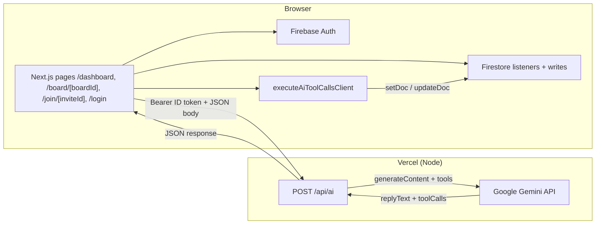

# Architecture — CollabBoard (PR 25)

## One-page diagram (FE ↔ API ↔ Firestore)

**Data flow:** The AI **never** writes Firestore directly. The server returns **tool calls**; the **client** applies them with the user’s credentials so rules and realtime behavior match the rest of the app.

### AI route (PR 19–21)

| Item | Detail |
|------|--------|
| Endpoint | `POST /api/ai` (`src/app/api/ai/route.ts`), Node runtime |
| Auth | `Authorization: Bearer <Firebase ID token>` — verified in `verify-firebase-id-token.ts` (JWT signature + `aud` / `iss` vs `NEXT_PUBLIC_FIREBASE_PROJECT_ID`) |
| Body | `{ "prompt": string, "boardId": string, "boardContext"?: string }` — `boardId` is required; caller must be **board owner** or **editor** member (see PR 35); optional **boardContext** from `buildBoardContextForAi()` |
| Secrets | `GEMINI_API_KEY`, optional `GEMINI_MODEL` (see `run-board-gemini.ts` fallbacks) |
| Response | `{ ok: true, data: { model, replyText, toolCalls, boardId, uid } }` or `{ ok: false, error: { code, message } }` — see `src/lib/ai-api-types.ts` |
| Tools | Declarations in `src/lib/ai-board-tools.ts`; **client execution** in `src/lib/ai-execute-tools-client.ts` after `/api/ai` returns (PR 20) |
| Board context | `buildBoardContextForAi()` in `src/lib/board-context-for-ai.ts` — sent as `boardContext` in POST body for Gemini |
| UI | `AiBoardPanel` on `/board/[boardId]` — loading, errors, reply + tool execution summary |

### Routing (PR 26)

- Canonical signed-in landing: **`/dashboard`**.
- Root **`/`** now redirects authenticated users to `/dashboard`, and keeps a public landing view for signed-out sessions.
- Dashboard lists boards from `users/{uid}/boards`, creates board ids client-side, then navigates to `/board/[boardId]`.

### Board sharing (PR 35)

- **Members:** `boards/{boardId}/members/{uid}` with `role: "editor"` or `"viewer"`. Editors (and owners) read/write canvas subcollections; viewers are read-only on objects/cursors/presence (writes denied).
- **Invites:** `boardInvites/{inviteId}` holds `boardId`, `ownerUid`, `createdAt`. Owner creates invite; invitee opens **`/join/[inviteId]`** (signed in) to create their member doc and `users/{uid}/boards/{boardId}` index, then redirects to the board.
- **Owner add by UID:** owner writes `members/{otherUid}` from the in-app share panel (collaborator must open the board once if index was not pre-created).
- **Client entry:** `ensureBoardAccess()` in `src/lib/boards-client.ts` resolves **owner vs member** before loading the canvas.

## Firestore path sketch (per-user boards)

PR 25 moves from a single demo board to dynamic board ids with owner scoping.

| Path | Purpose |
|------|--------|
| `boards/{boardId}` | Board metadata doc: `title`, `ownerUid`, `createdAt`, `updatedAt`. |
| `users/{uid}/boards/{boardId}` | User-owned board index for dashboard queries and ownership bootstrap. |
| `boards/{boardId}/objects/{objectId}` | Canvas entities — **PR 09:** one **subcollection doc per object** (not a single map doc): `type` discriminator + geometry/style fields; see `src/lib/board-object.ts`. |
| `boards/{boardId}/cursors/{userId}` | Live cursor: **`x`**, **`y`** in **Konva world** space (pan/zoom; PR 08), **`name`**, **`updatedAt`** — ~50ms trailing debounce + world epsilon; doc removed on leave board. |
| `boards/{boardId}/presence/{userId}` | Presence: `displayName`, `online`, `lastSeen` — **PR 06:** ~12s heartbeat, `online: false` on unmount / `pagehide`; UI treats users as online if `lastSeen` is within ~30s and `online !== false`. |
| `boards/{boardId}/members/{uid}` | **PR 35:** collaborator `role` (`editor` / `viewer`); owner-managed or self-created via invite. |
| `boardInvites/{inviteId}` | **PR 35:** invite token doc for join URL (`boardId`, `ownerUid`, `createdAt`). |

## Object storage (PR 09)

- **Choice:** **`boards/{boardId}/objects/{objectId}`** subcollection — scales with many shapes, simple security rules, per-object listeners.
- **Client:** `useBoardObjects` → `onSnapshot` on the collection; Konva renders from sorted `zIndex`.

## Object document (example fields)

Unified `type` discriminator; adjust to match Konva + PRD.

- `type`: `"sticky"` \| `"rect"` \| `"circle"` \| `"line"` \| `"freehand"` \| `"frame"` \| `"text"` \| `"comment"` \| `"connector"` \| … — **PR 10:** `sticky` uses `text` (string), `fill` / `stroke`, `width` / `height` ~220×160; debounced `updateDoc` for `x`,`y` and `text`. **PR 11:** `circle` uses center `x`,`y` + `radius`; `line` uses `x1`,`y1`,`x2`,`y2` and `stroke` (no fill). **PR 28:** `freehand` — flat `points` `[x0,y0,…]`, `stroke`, `strokeWidth`, `opacity`; client commits new strokes with `setDoc` (same objects collection); selectable, not transform-resized. **PR 29:** `comment` — pin at `x`,`y` with single `body` string (MVP thread); `setDoc` on place; **lasso** selection uses anchor point-in-polygon. **PR 12:** client-only **selection** (click, Shift+toggle, marquee); **Konva `Transformer`** on rect/circle/sticky/frame/text; geometry patches debounced via `queueObjectPatch` (~400ms merge per object). **Lines**, **freehand**, and **connectors** are selectable but not transform-resized. Selection is **not** synced—remote deletes prune stale ids locally. **PR 14:** **`frame`** — `title`, semi-transparent `fill`, new frames get `zIndex` below existing objects so later objects paint on top (no `childIds` list yet). **`text`** — `fontSize`, `fill` (text color), double-click HTML editor like stickies. **`connector`** — `fromId` / `toId`; **Konva `Arrow`** between object **centers**; layer draws after other objects; if an endpoint is missing the connector is not rendered.
- `x`, `y`, `width`, `height`, `rotation`
- `fill`, `stroke`, `text`, `zIndex` (or `order`)
- `updatedAt` — **server** timestamp on each `updateDoc` from the client; narrative for LWW / debugging, not used for merge logic yet. See **[CONFLICTS.md](./CONFLICTS.md)** (per-field merge, same-field LWW).
- Connector: `fromObjectId`, `toObjectId` (or anchor points)

## Security rules (PR 25 + PR 35)

- Implemented in repo root [`firestore.rules`](../firestore.rules): board **metadata** updates remain **owner-only**; **objects / cursors / presence** allow **owner + editor** members (read-only for **viewer** members). Explicit subcollection paths replace a single wildcard so `members` and `objects` can differ.
- **`boardInvites`**: owner creates invite for a board they own; any signed-in user may **read** a doc by id (join uses secret id); invite delete by owner.
- **`members`**: owner adds/removes collaborators; invitee may create **their own** member doc with validated `inviteId`; member may delete self (leave).
- User index path `users/{uid}/boards/{boardId}` allows only that authenticated `uid`.
- **Publish** via Console or `firebase deploy --only firestore:rules` (see README).
- Default deny for everything else.

## Clipboard (PR 15)

- **Copy** writes a prefixed JSON string (`collabwb:v1:` + payload) via **`navigator.clipboard`** and mirrors it in an in-memory ref for the same session if the write fails.
- **Paste** assigns new Firestore doc ids, shifts geometry by **32px**, remaps **connector** endpoints when both ends were in the copied set, then **`setDoc`** each item.

## Performance (PR 17)

- Object patches: debounced merge + **`writeBatch`** (see `useBoardObjectWrites`, `docs/PERF_NOTES.md`).
- Cursors: debounced `setDoc` + epsilon (`src/lib/cursors.ts`).
- Konva: split layers; memoized shape components where equality is cheap.

## Text search (PR 16)

- **Client-only:** substring match (case-insensitive) on **`sticky.text`** and **`text.text`** in the current snapshot — no Firestore query, no Algolia.
- **UI:** toolbar `type="search"` input; match count; non-matching stickies/text are **dimmed**, matches get an **amber** stroke (selection green still wins). **Esc** clears the query first (see board keyboard handler).

## Related

- [MANUAL_QA_MATRIX.md](./MANUAL_QA_MATRIX.md) — two-browser checklist, refresh, stress, network (PR 18)
- [CONFLICTS.md](./CONFLICTS.md) — concurrent edits, per-field `updateDoc`, LWW on same field; connector endpoint deletes
- [FIREBASE_CONSOLE_CHECKLIST.md](./FIREBASE_CONSOLE_CHECKLIST.md) — PR 02 console steps
- [PRESEARCH_AND_TRACKING.md](../PRESEARCH_AND_TRACKING.md) — stack decisions
